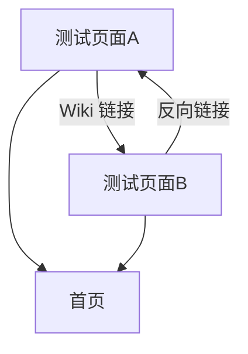

# 测试页面B

这是测试页面B。如果你是通过 [[测试页面A]] 的链接跳转过来的，说明 **Wiki 链接** 功能正常！

## 反向链接测试

本页面底部应该显示「反向链接」（Backlinks），其中会列出 [[测试页面A]]。

## Callout 测试

> [!note]
> 这是一个 Note 类型的 Callout。

> [!warning]
> 这是一个 Warning 类型的 Callout。

> [!tip]
> 这是一个 Tip 类型的 Callout。

> [!info]
> 这是一个 Info 类型的 Callout。

## Mermaid 图表测试

[[index|← 返回首页]]
